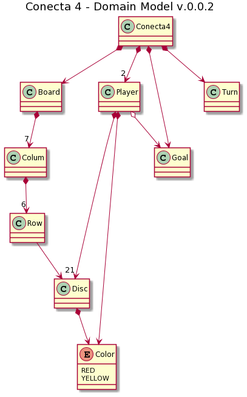

# CONNECT FOUR

**Asignatura Diseño y calidad software**

Práctica 1

Tema 2 - Disciplina de diseño software

## Rules
* [Wikipedia](https://en.wikipedia.org/wiki/Connect_Four)

## Domain model



## GUI Console
```
|---------------------------------|
|              BOARD              |
|---------------------------------|
| o || o || o || o || o || o || o |
| o || o || o || o || o || o || o |
| o || o || o || o || o || o || o |
| o || o || o || o || o || o || o |
| o || o || o || o || o || o || o |
| o || o || o || o || o || o || o |
|---------------------------------|
Insert column number to dropping disc of color YELLOW: 2


|---------------------------------|
|              BOARD              |
|---------------------------------|
| o || o || o || o || o || o || o |
| o || o || o || o || o || o || o |
| o || o || o || o || o || o || o |
| o || o || o || o || o || o || o |
| o || o || o || o || o || o || o |
| o || Y || o || o || o || o || o |
|---------------------------------|
Insert column number to dropping disc of color RED: 3


|---------------------------------|
|              BOARD              |
|---------------------------------|
| o || o || o || o || o || o || o |
| o || o || o || o || o || o || o |
| o || o || o || o || o || o || o |
| o || o || o || o || o || o || o |
| o || o || o || o || o || o || o |
| o || Y || R || o || o || o || o |
|---------------------------------|
Insert column number to dropping disc of color YELLOW: 


|---------------------------------|
|              BOARD              |
|---------------------------------|
| R || o || o || o || o || o || o |
| Y || o || o || o || o || o || o |
| R || o || o || o || o || o || o |
| Y || o || o || o || o || o || o |
| R || o || o || o || o || o || o |
| Y || Y || R || o || o || o || o |
|---------------------------------|
Insert column number to dropping disc of color YELLOW: 1
invalid Dropping


```
### No winner
```
|---------------------------------|
|              BOARD              |
|---------------------------------|
| R || Y || R || R || R || R || o |
| Y || R || Y || Y || Y || Y || Y |
| R || Y || R || R || R || R || R |
| Y || R || Y || Y || Y || Y || Y |
| R || Y || R || R || R || R || R |
| Y || Y || R || Y || Y || Y || Y |
|---------------------------------|
Insert column number to dropping disc of color RED: 7
END OF GAME, BYE!
```

### Winner player
```
|---------------------------------|
|              BOARD              |
|---------------------------------|
| R || Y || R || O || R || R || o |
| Y || R || Y || O || Y || Y || Y |
| R || Y || R || O || R || R || R |
| Y || R || Y || Y || Y || Y || Y |
| R || Y || R || Y || R || R || R |
| Y || Y || R || Y || Y || Y || Y |
|---------------------------------|
Insert column number to dropping disc of color YELLOW: 3
###################################
#                                 #
# !PLAYER COLOR YELLOW IS WINNER! #
#                                 #
###################################
END OF GAME, BYE!
```
