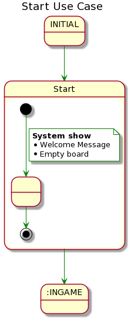
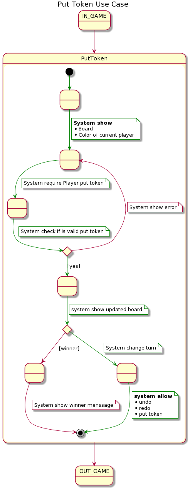
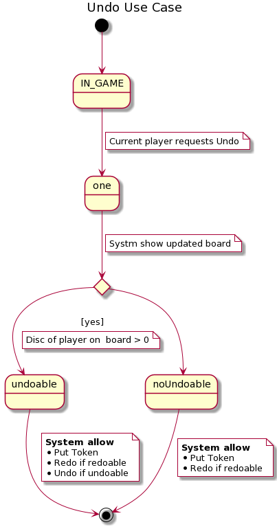
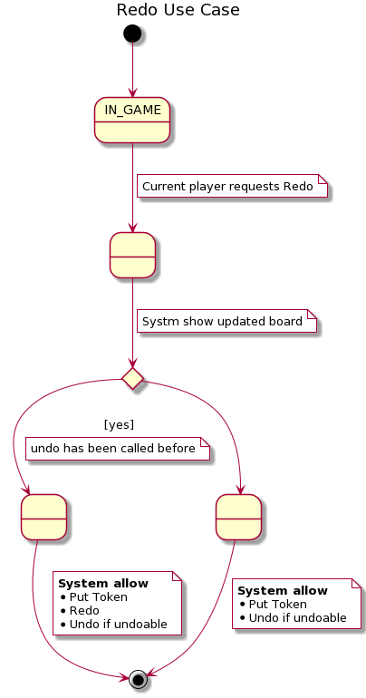
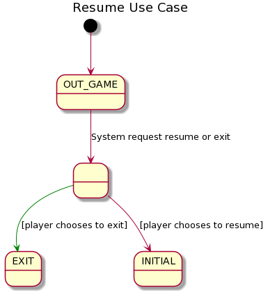

# connect4 con undo redo 

## casos de uso

## Contexto de casos de uso

## Descripción de casos de uso

### Start

### Put token

### Undo

### Redo

### Resume

## Arquitectura MVP Presentation Model 

