# connect4 con undo redo 

# Requisitos

## casos de uso

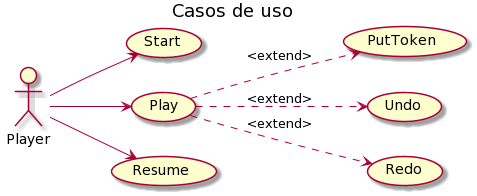

## Contexto de casos de uso

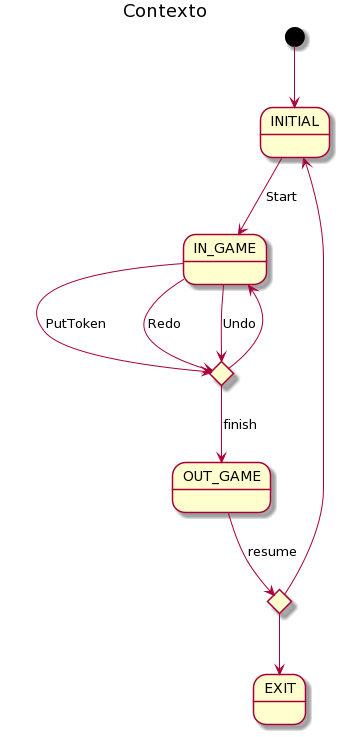

## Descripción de casos de uso

### Start
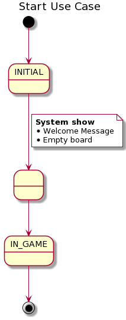

### Play
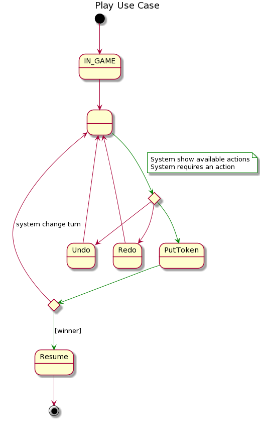

### Put token
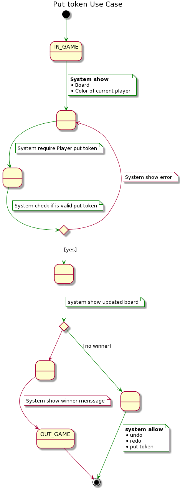

### Undo
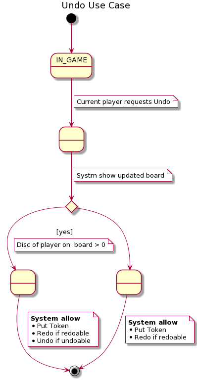

### Redo
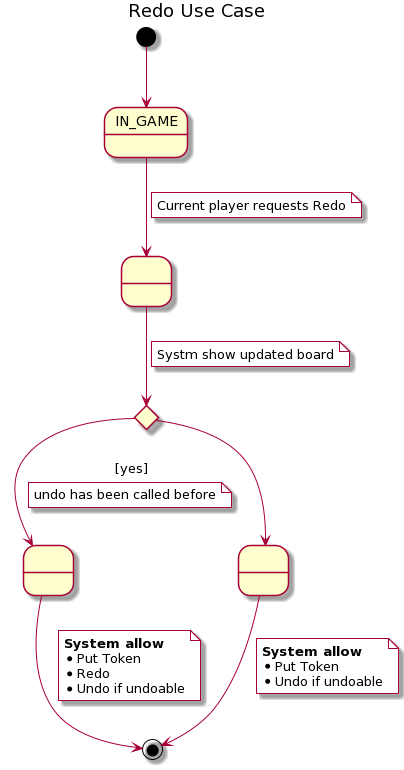

### Resume
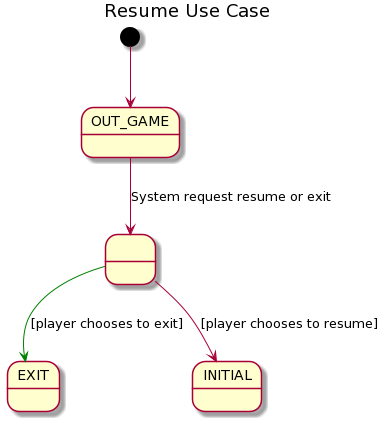

# Analisis
## Arquitectura

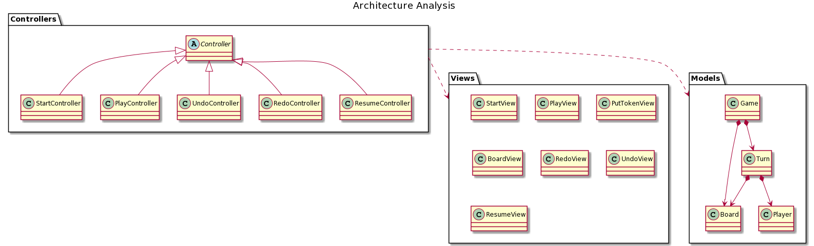

## Casos de uso 

### Play
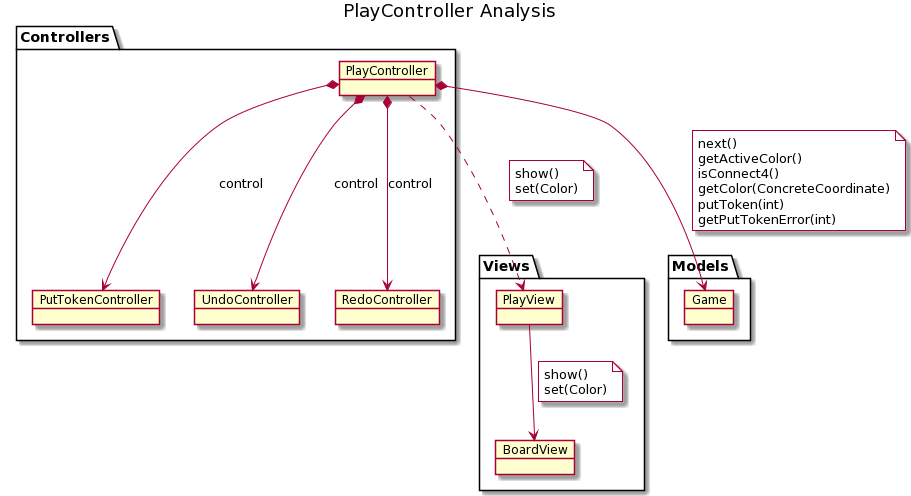

# Diseño
## Arquitectura
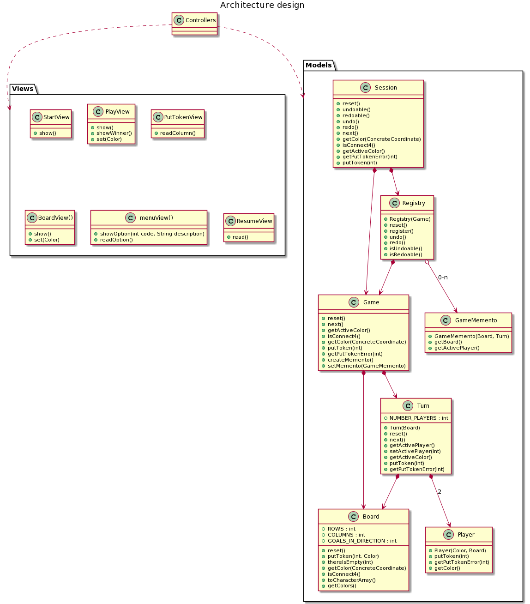

